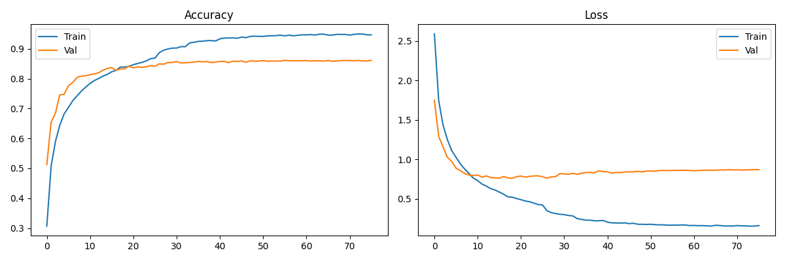
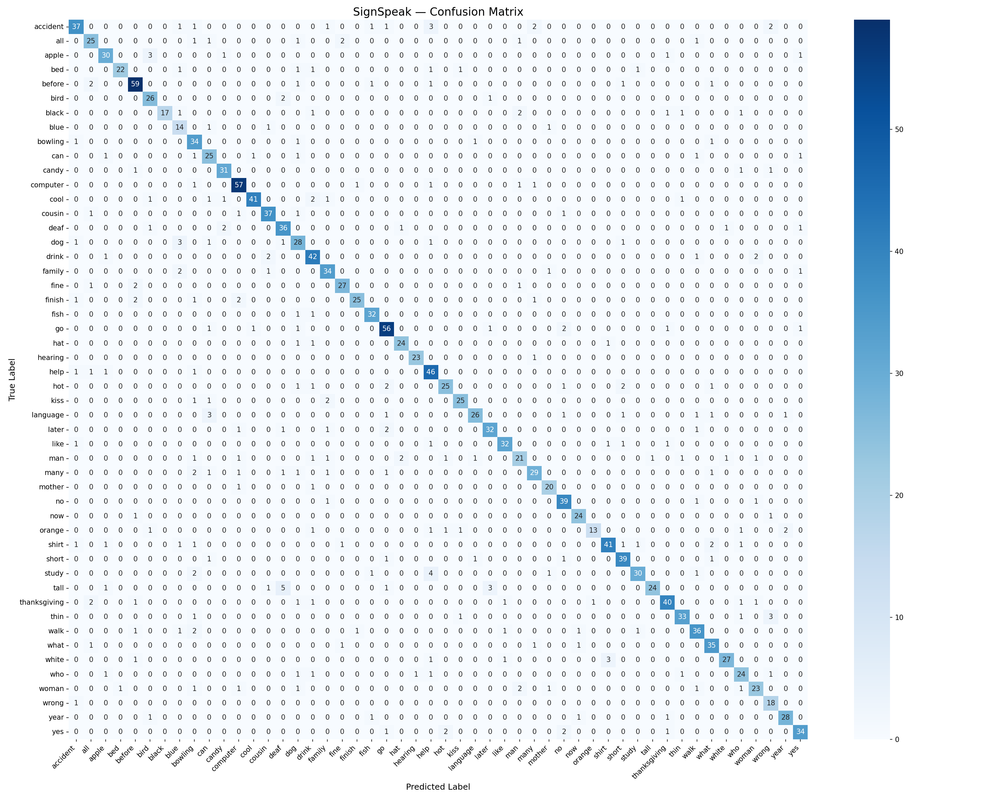

# SignSpeak 🤟
### Real-Time Sign Language to Voice Translation Using Machine Learning and Computer Vision


---

## 📌 Overview

SignSpeak is a real-time American Sign Language (ASL) recognition system that translates hand gestures into audible voice output using a standard webcam — no specialized hardware required.

The system uses **Google MediaPipe** for dual-hand landmark extraction and a **Multilayer Perceptron (MLP)** classifier trained on a curated subset of the **WLASL dataset** to recognize 50 high-frequency ASL word signs, which are then spoken aloud using **Windows SAPI Text-to-Speech**.

---

## 🎯 Key Features

- ✅ Recognizes **50 ASL word signs** in real time
- ✅ **Dual-hand landmark extraction** — 126-dimensional feature vector
- ✅ Supports both **single-handed and two-handed** signs
- ✅ **86.17% test accuracy** on WLASL subset
- ✅ **Temporal smoothing** — 15-frame sliding window buffer
- ✅ **Hold confirmation** — 2-second stability check before speaking
- ✅ **Offline TTS** via Windows SAPI — no internet needed
- ✅ **No GPU required** — runs on standard laptop
- ✅ Real-time **sentence builder** displayed on screen

---

## 🧠 System Architecture
Webcam Frame
↓
OpenCV Frame Capture + Horizontal Flip
↓
MediaPipe Dual-Hand Landmark Extraction (126 features)
↓
Z-score Normalization
↓
MLP Classifier → Predicted Word + Confidence Score
↓
Temporal Smoothing Buffer (15 frames)
↓
Hold Confirmation (2 seconds)
↓
Windows SAPI Text-to-Speech Output
↓
Sentence Builder (displayed on screen)

---

## 📁 Project Structure
SignSpeak/
│
├── signspeak_voice.py        ← Main real-time detection + voice output
├── train_model3.py           ← Model training with augmentation
├── extract_landmarks2.py     ← Dual-hand landmark extraction
├── extract_frames.py         ← Frame extraction from videos
├── prepare_dataset.py        ← Dataset organization
├── explore_dataset.py        ← Dataset exploration
├── fix_dataset.py            ← Dataset cleaning
├── check_csv.py              ← CSV validation
├── generate_results.py       ← Confusion matrix + classification report
├── test_setup.py             ← Library verification
├── test_webcam.py            ← Webcam test
├── test_mediapipe.py         ← MediaPipe test
│
├── signspeak_model.h5        ← Trained MLP model
├── label_encoder.pkl         ← Label encoder (50 classes)
├── X_mean.npy                ← Normalization mean
├── X_std.npy                 ← Normalization std
│
├── training_results.png      ← Accuracy/Loss curves
├── confusion_matrix.png      ← 50-class confusion matrix
├── classification_report.txt ← Per-class precision/recall
│
└── README.md

---

## 📦 Dataset

- **Source:** [WLASL — World Level American Sign Language](https://www.kaggle.com/datasets/risangbaskoro/wlasl-processed)
- **Subset:** 50 high-frequency ASL words
- **Videos:** 569 total (avg. 11.38 per class)
- **Frames extracted:** 16,900
- **Landmark samples:** 9,211
- **After augmentation:** ~37,000 training samples

### 50 Supported Signs
accident, all, apple, bed, before, bird, black, blue, bowling, can,
candy, computer, cool, cousin, deaf, dog, drink, family, fine, finish,
fish, go, hat, hearing, help, hot, kiss, language, later, like,
man, many, mother, no, now, orange, shirt, short, study, tall,
thanksgiving, thin, walk, what, white, who, woman, wrong, year, yes

---

## 🏗️ Model Architecture

| Layer | Units | Activation | Regularization |
|-------|-------|-----------|----------------|
| Input | 126 | — | — |
| Dense 1 | 1024 | ReLU | BatchNorm + Dropout(0.4) |
| Dense 2 | 512 | ReLU | BatchNorm + Dropout(0.3) |
| Dense 3 | 256 | ReLU | BatchNorm + Dropout(0.3) |
| Dense 4 | 128 | ReLU | BatchNorm + Dropout(0.2) |
| Output | 50 | Softmax | — |

- **Optimizer:** Adam (lr = 0.001)
- **Loss:** Sparse Categorical Cross-Entropy
- **Callbacks:** EarlyStopping, ModelCheckpoint, ReduceLROnPlateau
- **Epochs to convergence:** 120 / 300

---

## 📊 Results

| Metric | Value |
|--------|-------|
| Test Accuracy | **86.17%** |
| Test Loss | 0.6897 |
| Training Samples (augmented) | ~37,000 |
| Test Samples | 1,843 |
| Classes | 50 |
| Convergence Epoch | 120 |

---

## ⚙️ Installation

### Prerequisites
- Python 3.10
- Webcam
- Windows OS (for SAPI TTS)

### Setup

```bash
# Clone the repository
git clone https://github.com/YOUR_USERNAME/SignSpeak.git
cd SignSpeak

# Create virtual environment
py -3.10 -m venv signspeak_env
signspeak_env\Scripts\activate

# Install dependencies
pip install opencv-python mediapipe tensorflow numpy matplotlib scikit-learn pyttsx3 gtts playsound==1.2.2 pandas seaborn
```

---

## 🚀 Usage

### Run Real-Time Detection
```bash
python signspeak_voice.py
```

### Controls
| Key | Action |
|-----|--------|
| Hold sign 2 sec | Speak the word |
| S | Clear sentence |
| Q | Quit |

---

## 🔁 Retrain the Model

If you want to retrain from scratch:

```bash
# Step 1 — Extract frames from videos
python extract_frames.py

# Step 2 — Extract landmarks (dual-hand)
python extract_landmarks2.py

# Step 3 — Train model with augmentation
python train_model3.py
```

---

## 📈 Training Results



---

## 🔀 Confusion Matrix



---

## 🛠️ Tech Stack

| Tool | Purpose |
|------|---------|
| Python 3.10 | Core language |
| OpenCV | Webcam capture + frame processing |
| MediaPipe | Dual-hand landmark extraction |
| TensorFlow / Keras | Model training |
| NumPy | Numerical computation |
| Scikit-learn | Label encoding + evaluation |
| Matplotlib / Seaborn | Visualization |
| Windows SAPI | Offline text-to-speech |

---

## 🔮 Future Work

- Implement **LSTM-based temporal modeling** for motion-based signs
- Expand vocabulary to full **WLASL 2000 words**
- Add **grammar-aware sentence construction** (ASL syntax)
- Port to **mobile platform** for broader accessibility
- Replace SAPI with **neural TTS** for natural voice output
- Conduct **user study** with DHH community members

---

## 📄 Paper

This project is documented as an IEEE-format term paper:

> **SignSpeak: Real-Time Sign Language to Voice Translation Using Machine Learning and Computer Vision**

Key contributions:
1. Dual-hand 126-dimensional landmark feature extraction
2. Lightweight MLP achieving 86.17% accuracy on 50-class WLASL subset
3. Temporal smoothing + hold confirmation for stable real-time inference

---

## 👨‍💻 Author

**Kishan**
Department of Information Science and Engineering
[Nitte Meenakshi Institute of Technology]

---
